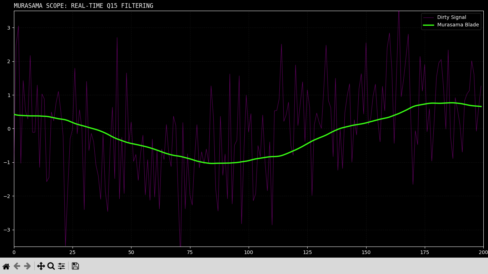

# Murasama Scope: Low-Level DSP Interface

**Fixed-Point Q15 Butterworth Implementation for Prosthetic Control**

A modular Python-based signal processing environment designed for high-fidelity EMG visualization. This project implements a 2nd-order Butterworth filter using only integer arithmetic (bit-shifting and fixed-point math) to simulate radiation-hardened or resource-constrained embedded environments.

> ***Disclaimer: That's a very old program and i'm just uploading 'cause I simply forget about it...***
> **"Ah.. Eto... Bleh!"**

## ⚡ Technical Architecture

- **Murasama Filter:** 2nd Order Butterworth Low-Pass (10Hz Cutoff @ 1kHz fs).
- **Arithmetic:** Q15 Fixed-Point (Integer-only DSP pipeline).
- **Logic Separation:** - `signal_factory.py`: DSP Core and XML parameter parsing.
  - `murasama_view.py`: High-performance Matplotlib animation loop.
- **Config:** External `config_parameter.xml` for real-time gain and coefficient tuning.

## 🛰️ I lost the original documentation so... this is the only thing I have

### 4. Final Version: 

 


> **Note: The green line (Murasama Blade) represents the real-time estimation of intent, while the magenta background represents raw environmental noise.**

## 🛠️ Installation & Usage

1. Ensure you have `numpy` and `matplotlib` installed.
2. Configure your filter coefficients in `config_parameter.xml`.
3. Run the visualization:
   ```bash
   python murasama_view.py